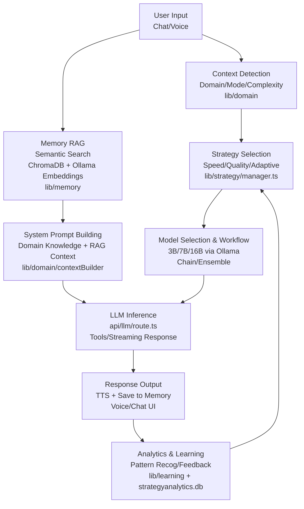

Hacker Reign processes information through interconnected systems like strategy selection, domain context, memory RAG, and LLM orchestration, as detailed in the project documentation.

## Overall Flow
User input enters via chat or voice, triggering context analysis for mode, domain, and complexity. Strategy system selects optimal LLM model and workflow, augmented by RAG retrieval from memory.

Memory retrieves similar past conversations using embeddings and vector search before LLM inference.

## Mermaid Flowchart

This flowchart captures the core information processing pipeline from input to adaptive feedback loop.